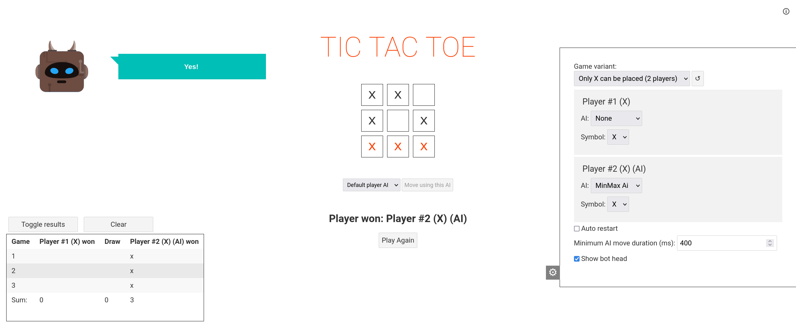
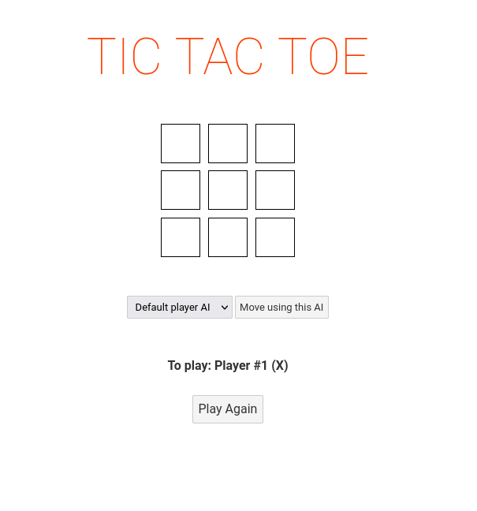
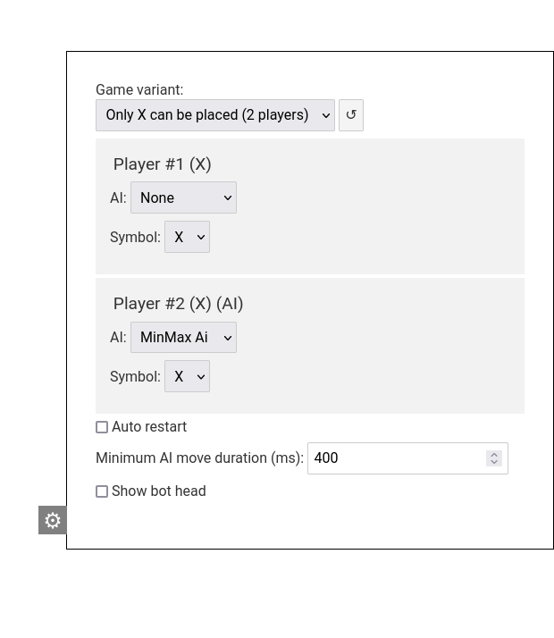
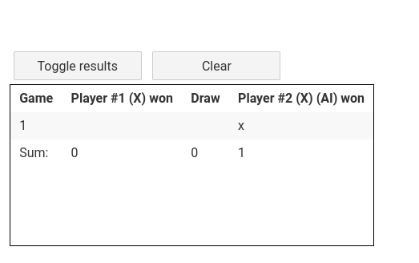

# Tic Tac Toe (with AI)

## Installation and running

### 1. Just run

#### Using external HTTP server

Any HTTP server ([Apache](https://apache.org/), [http-server](https://www.npmjs.com/package/http-server))

Start the server, so that you can access files from `public`

For [http-server from npm](https://www.npmjs.com/package/http-server):

```bash
npx http-server public
```

App should be served under http://127.0.0.1:8080/.

#### Built-in server (sirv)

You can also user built in server.
To do so, you need [Node.js](https://nodejs.org/en/) and npm installed and run

```bash
npm run start
```

App will be available under http://127.0.0.1:8080/


### 2. Building from source

To build from source you will need [Node.js](https://nodejs.org/en/) and npm

Build commands:

```bash
npm install
npm run build
```

To run in developer mode:

```bash
npm run dev
```

To serve built application:

```bash
npm run start
```

App will be available under http://127.0.0.1:8080/


## Game

By default the game launches in Only X mode, meaning that both players place X signs, the one who creates three in line **loses**.

It also has one human player and one AI (MinMax) set by default.

Those settings can be changed in the [settings panel](#settings-panel).



### Game field



#### Board

the board allows you to see game state and make moves. To make a move, just click any available (empty) spot.

#### AI move

If you want AI to make a move instead of you or you just selected an AI for the player (then the player will not make the move immediately in case of a mouse slip) then you can press the button `Move using this AI` and current player's assigned AI will be used to make a move.

Note: If no AI is assigned to the player you can use the dropdown menu right next to the button to choose which AI to use.

#### To play

This field shows whose turn it is. It also displays info about game result.

#### Play again 

This button resets the board and starts a new game.

### Settings panel

Settings panel allows you to change some game options:



#### Showing and hiding settings panel

To show/hide settings panel use the gray button with cogwheel icon.

#### Game variant

Use this field to choose which game variant you want to play.

Note! After changing the variant, the board is reset and new game is started. You may need to change or [reset](#settings-reset) some settings for game to start. 

#### Settings reset

A button with ↺ icon located next to game variant field can be used to reset settings to default values set for given game variant. It also restarts the game.

#### Players settings

Each player can be assigned any of the available AIs. If current player has an AI assigned, during their move it will be used to determine which move to make. If player has no AI set (`None`) then move can be made by human or using the [AI Move button](#ai-move)

You can also change symbols assigned to each player here, but game variant may not allow for some configurations.

#### Auto restart

If this field is checked, the game will restart automatically after it finishes.

When checked, a field appers beneath where you can adjust the wait duration from game finish to reset.

#### Minimum AI move duration

Sets the minimal time delay (in milliseconds) after which AI will make a move. Useful for tracking games of AIs that move too fast to see what is happening. If set to 0, the move will be executed as soon as it is available.

#### Show bot head

Shows or hides bot head when playing Human vs CPU.

### Results table

This table registers all games and their results. The last row sums up all the data.



#### Toggle results

This button shows and hides results table.

#### Clear

This button clears saved records.


---

## From Svelte:

## Get started

Install the dependencies...

```bash
cd svelte-app
npm install
```

...then start [Rollup](https://rollupjs.org):

```bash
npm run dev
```

Navigate to [localhost:8080](http://localhost:8080). You should see your app running. Edit a component file in `src`, save it, and reload the page to see your changes.

By default, the server will only respond to requests from localhost. To allow connections from other computers, edit the `sirv` commands in package.json to include the option `--host 0.0.0.0`.

If you're using [Visual Studio Code](https://code.visualstudio.com/) we recommend installing the official extension [Svelte for VS Code](https://marketplace.visualstudio.com/items?itemName=svelte.svelte-vscode). If you are using other editors you may need to install a plugin in order to get syntax highlighting and intellisense.

## Building and running in production mode

To create an optimised version of the app:

```bash
npm run build
```

You can run the newly built app with `npm run start`. This uses [sirv](https://github.com/lukeed/sirv), which is included in your package.json's `dependencies` so that the app will work when you deploy to platforms like [Heroku](https://heroku.com).


---

&copy; 2022, ADIOP55550
